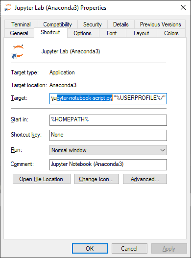

```{r setup, include=FALSE}
knitr::opts_chunk$set(echo = FALSE)
```

## JupyterLab

You will be using Jupyter Notebooks, or JupyterLab software, both for learning R (together with RStudio) and Python. You may be familiar with the format already if you use Kaggle.

I have decided to prepare this guide, as installation - though maybe not rocket science - is not trivial.

## What this installation includes

The software you will need to complete this installation includes:

- R,
- Chrome browser,
- Anaconda Python,
- JupyterLab.

Let's get started.

**Warning** - these instruction are aimed at Windows users. Mac users, I won't be able to help you much if you run into problems. Google is your friend if something goes awry. Linux users, I am pretty sure you can do it without much outside help.

## Prerequisites

Please install R (<https://cloud.r-project.org/>) and the Chrome browser (<https://www.google.com/chrome/>), if you don't have them already.

## Anaconda Individual Edition

Anaconda Individual Edition is a Python distribution geared towards data science, as it already includes many useful libraries. Download the Anaconda Individual Edition with newest version of the Python installer here: <https://www.anaconda.com/distribution/>


Run the installer to install Anaconda on your machine:


## JupyterLab

To Install JupyterLab, first run Anaconda prompt (a newly installed app) as the Administrator. **Warning** - do not run Anaconda Powershell Prompt, but the Anaconda Prompt.


Type the following command in the prompt (Linux-style):

`conda install -c conda-forge jupyterlab`


When you get asked a question, answer `y`:


Now we're going to create a shortcut icon for JupyterLab. Again in the Anaconda prompt, ran as Administrator, type:

`jupyter lab --generate-config`


Take note of the path given in the output:


Edit the file in the path above with an editor of your choice. I use Notepad++ (<https://notepad-plus-plus.org/downloads/>).
Add the following line:

`c.NotebookApp.browser = "C:/Program Files (x86)/Google/Chrome/Application/chrome.exe --app=%s"`


If your Chrome browser is not installed in the default location, locate `chrome.exe` file yourself and use your actual path.

Then navigate to:
`"C:\Users\<User>\AppData\Roaming\Microsoft\Windows\Start Menu\Programs\Anaconda3 (64-bit)"`


Make a copy of the Jupyter Notebook shortcut. If the Jupyter Notebook shortcut is not there, try this path:
`"C:\ProgramData\Microsoft\Windows\Start Menu\Programs\Anaconda3 (64-bit)"`


Rename the shortcut to Jupyter Lab:


Access the properties of the shortcut in order to edit them:



You need to change the highlighted part from `jupyter-notebook-script.py` to `jupyter-lab-script.py`.


Also change the comment field appropriately:


Your brand new shortcut should be visible in the Start Menu already:


## Adding R kernel to JupyterLab

Now comes the time to add the R kernel to JupyterLab, so we can use the Jupyter environment for both Python and R projects. This should do the job (in the prompt again):

`conda install -c r r-irkernel`

Close everything and run JupyterLab from your Start Menu:


If everything went according to the plan, you'll see this screen:


**Congrats!**

## Troubleshooting

More instructions on the R kernel in JupyterLab (also for Mac users), if does not go the easy way, can be found here:
<https://richpauloo.github.io/2018-05-16-Installing-the-R-kernel-in-Jupyter-Lab/>